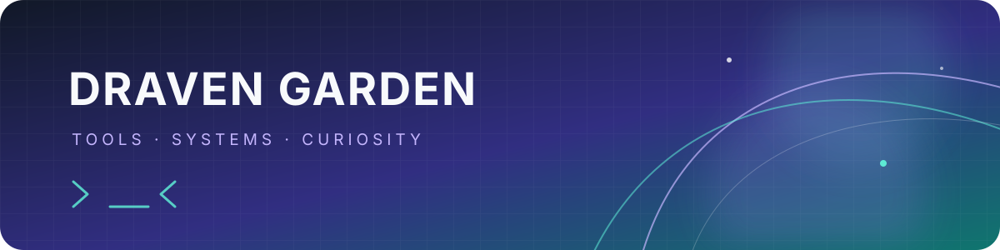

# Hi, I'm Draven 👋

Broad technical interests, continuous learning, and putting knowledge into practice.

  
  
  

## ⚡ About me

- Full-stack engineer who learns whatever tools are needed to solve each problem, without limiting myself to what I already know.
- Enjoy using technology to solve real-world problems.

## 🛠️ Technologies

### Languages I use

  

### Tools & technologies

  

  
  
  
  
  
  

## 📚 Currently learning

- Quantitative trading systems
- Large language models and harness systems

## 📫 Find me

- Email: [dravengarden@gmail.com](mailto:dravengarden@gmail.com)

Build thoughtfully. Keep learning. 🌱

